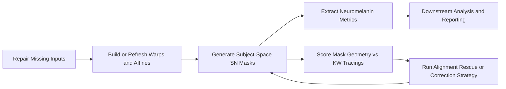

# SN Project Bundle

I build research imaging workflows that have to do two things at the same
time: produce analysis-ready outputs reliably and make it possible to measure
whether those outputs are anatomically credible. This repository is a public,
sanitized code sample from my substantia nigra imaging work, centered on
neuromelanin processing and mask-alignment improvement against manual KW
tracings.

The code centers on two closely related problems:

1. building and refreshing subject-space neuromelanin analysis inputs
2. improving the geometric alignment of substantia nigra group masks against
   manual KW tracings

The scripts are research-pipeline code rather than a polished software package.
They show how I structured multi-stage imaging workflows, tracked dependencies
across spaces and modalities, and built reusable tooling around registration,
mask generation, QC, and downstream analysis.

## Technical Highlights

- multi-stage imaging pipeline design across Bash, Python, MATLAB, and R
- subject-space mask generation from atlas/template inputs plus warp chains
- geometry scoring against manual tracings using distance- and overlap-based
  summaries
- batch-oriented QC and manifest generation for auditable reruns
- separation between production refresh code and correction/optimization code

## Workflow Diagram

## Repository Layout

- `ogrady_black_ant_refresh/`
  refresh and maintenance workflow for Black ANT style SN processing, including
  cleanup, warp/atlas prerequisites, mask generation, metric extraction, and
  reporting handoff
- `pym_sn_kw_alignment/`
  native-space SN-to-KW alignment workflow, including scoring, routing,
  warp-guided correction, rescue sweeps, and fallback reporting

## How The Two Parts Fit Together

`ogrady_black_ant_refresh/` is the production-oriented side of the SN work. It
focuses on generating the inputs needed for analysis: corrected images,
subject-space masks, and neuromelanin metrics.

`pym_sn_kw_alignment/` is the geometry-improvement side. It focuses on whether
the masks are landing in the right place and how to iteratively improve that
placement relative to manual truth data.

Together, they represent both sides of an imaging pipeline:

- getting outputs to exist reliably
- improving whether those outputs are anatomically correct

## What A Reviewer Can Look For

- explicit stage-based organization rather than one giant script
- practical handling of mixed Bash, Python, MATLAB, and R workflow pieces
- repeated use of manifests, subject lists, and derived tables to keep batch
  processing auditable
- alignment/QC logic that tries to measure whether a geometric change helped,
  not just whether a job completed
- willingness to build tooling around the research question instead of relying
  only on manual reruns

## Public Release Notes

This is a public-safe copy of the original internal bundle.

- fun script names and the overall voice were preserved
- lab-specific paths were replaced with placeholders
- real email addresses were removed
- some hard-coded cohort defaults were replaced with example values

As a result, this repository is best read as a portfolio and workflow sample
first, and only second as a directly runnable drop-in environment.
